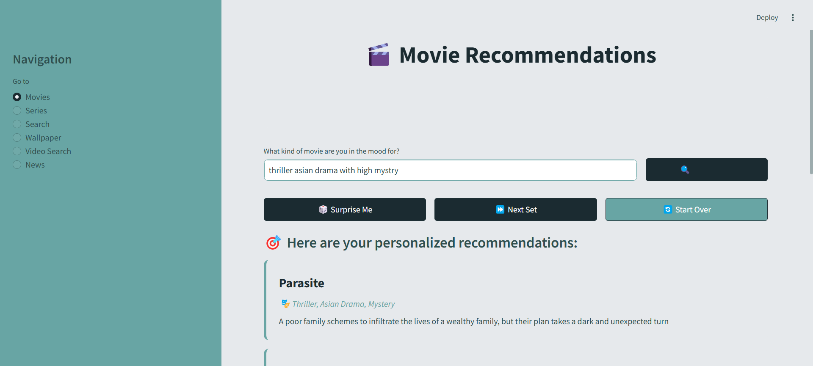
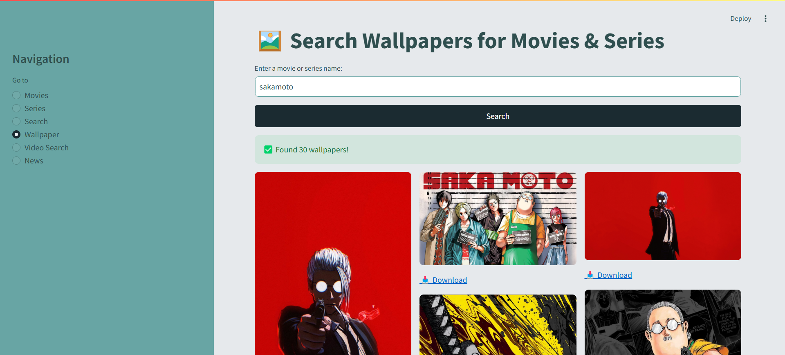
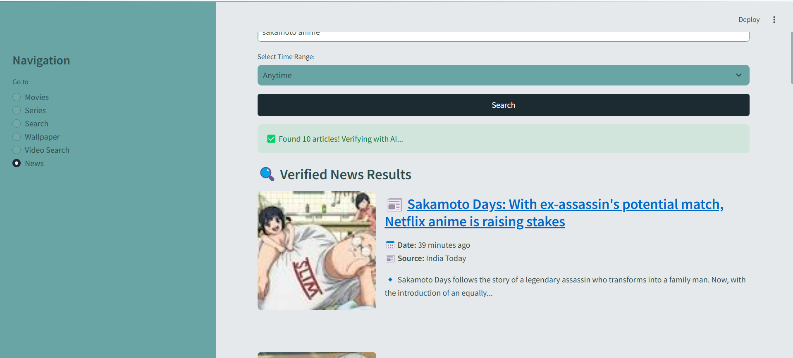

### **📢 BingeBot - Your Ultimate Entertainment & News Companion!**  

Welcome to **BingeBot**, a powerful **AI-enhanced** search assistant that helps you **find, explore, and verify** content across different categories, including **Movies, Series, Wallpapers, Videos, and News**. 🎬📰✨  

Whether you're looking for the **latest movie details, high-quality wallpapers, trending videos, or AI-verified news**, BingeBot has got you covered!  
 
---

## **🚀 Features**
### 🔎 **1. Movie & Series Search**  
- Enter a **movie or series title** and instantly **fetch IMDb links**.  
- Scrapes and **extracts detailed information** about the movie or series.  
- Uses **AI summarization** (via **Groq**) to provide a **clean, structured overview**.  

### 🖼 **2. High-Quality Wallpapers**  
- Enter a movie or series title and **fetch up to 100 wallpapers**.  
- Supports **direct downloads** without page reloads.  
- **Batch deletion** allows clearing old images with one click.  

### 🎥 **3. Video Search (Trailers, Clips, Interviews, Reviews)**  
- Search for **YouTube & other platform videos** related to a movie or topic.  
- Displays **thumbnails**, **titles**, and **direct video links** for quick access.  

### 📰 **4. AI-Verified News**  
- Fetches **real-time news** from **trusted sources**.  
- Uses **AI verification (Groq)** to ensure **only relevant news** is displayed.  
- Supports **time filtering** (**Past Hour, Day, Week, Month, Year**).  

---

## **🛠️ Technologies Used**
- **🔍 Serper API** – Fetches **Google search results** (Movies, Wallpapers, Videos, News).  
- **🤖 Groq AI** – Ensures **accurate AI verification and summarization**.  
- **🖥️ Streamlit** – Interactive **Python-based UI** for a seamless user experience.  
- **📡 Requests** – Fetches **real-time data from APIs**.  

---

## **📸 Screenshots**  
| Movie Search                   | Wallpapers                   | Videos                   | AI-Verified News |
|--------------------------------|------------------------------|--------------------------|------------------|
|  |  |  |  |

---

## **📥 Installation & Setup**
```bash
# 1️⃣ Clone the repository
git clone https://github.com/yourusername/BingeBot.git  
cd BingeBot  

# 2️⃣ Install dependencies
pip install -r requirements.txt  

# 3️⃣ Set API keys (Create a .env file)
echo "SERPER_API_KEY=your_serper_api_key" >> .env  
echo "GROQ_API_KEY=your_groq_api_key" >> .env  

# 4️⃣ Run the application  
streamlit run main.py  
```

---

## **📚 Usage Guide**
1️⃣ **Search Movies & Series** – Enter a title, fetch IMDb details, and get an AI summary.  
2️⃣ **Download Wallpapers** – Search, preview, and download HD wallpapers instantly.  
3️⃣ **Watch Videos** – Fetch trailers, reviews, and related clips.  
4️⃣ **Read AI-Verified News** – Search for the latest news with AI verification.  

---

## **🛠️ Future Improvements**
✅ Add **User Login & Personalization**.  
✅ Implement **Watchlist & Favorite Wallpapers**.  
✅ Improve **AI verification accuracy**.  
✅ Introduce **multi-language support**.  

---

## **🤝 Contributing**
Love BingeBot? Feel free to **contribute, suggest features, or report bugs**.  
```bash
# Fork the repository
git fork https://github.com/yourusername/BingeBot.git

# Create a new branch
git checkout -b feature-branch

# Make changes and commit
git commit -m "Added a cool feature"

# Push and submit a PR
git push origin feature-branch
```

---

## **📄 License**
This project is **open-source** under the **MIT License**.  

---

## **💬 Have Questions?**
Feel free to reach out! 🚀

👉 **GitHub:** [@AdarshAjay](https://github.com/achuajays)

🐦 **Linkedin:** [@Adarsh Ajay](https://www.linkedin.com/in/adarsh-ajay-9a8073226/)  

---

**🎬 Ready to explore? Run BingeBot now!** 🚀  
